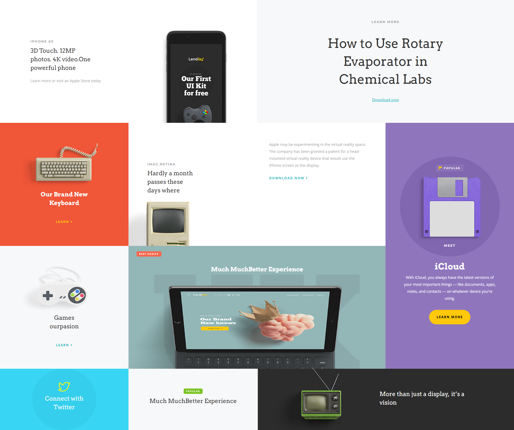

# Grid Masterclass  
A modern landing-page/styled layout built using CSS Grid for responsive, visual-rich design.

**Live demo:** [https://grid-masterclass-demo.netlify.app/](https://grid-masterclass-demo.netlify.app/)

---

## 🚀 Project Overview  
This project demonstrates the power and flexibility of CSS Grid :  
- A multi-section landing layout with large visuals, typography, and dynamic modules  
- Grid-based layout-structure enabling both horizontal + vertical alignment control  
- Fully responsive across screen sizes (desktop → mobile)  

---

## 🎯 Features  
- Uses CSS Grid for the main layout: rows, columns, spans 
- Visual layering of background images, text blocks 
- Responsive adjustments at breakpoints (tablet, mobile)  
- Clean CSS

---
## 📸 Screenshots

### 🖼️ HERO SECTION

